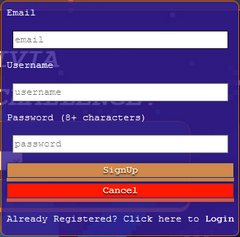
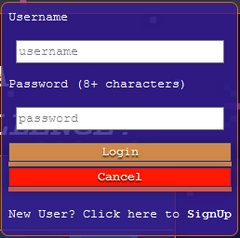
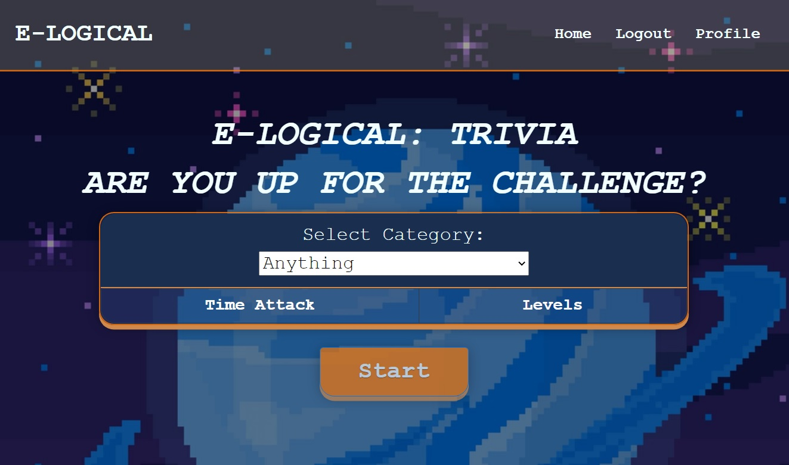
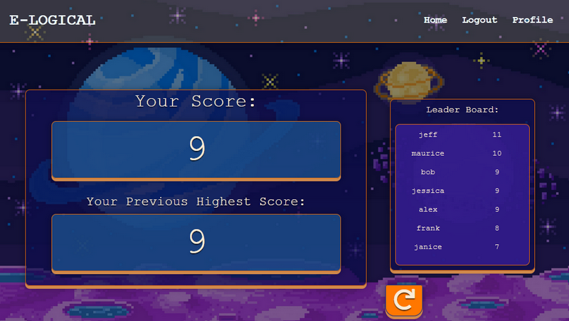
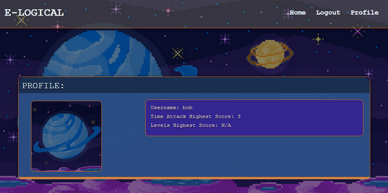

# E-Logical Trivia

## Description
E-Logical Trivia is an interactive trivia application developed with full stack web technologies using the [Open Trivia Database API](https://opentdb.com/) to generate the trivia questions.

See the deployed app here: [E-Logical Trivia App](https://vast-ocean-41089.herokuapp.com/)

## Table of Contents
- [Usage](#usage)
- [Contributing](#Contributing)
- [License](#license)

## Usage
The user can create an account with username, email, and password. Existing users can login.

 Afterwards choose between two game modes: Time Attack where the user can answer as many questions before time runs out, or Levels where for every ten questions, the difficulty of the trivia rises. 
 
 

 The user's score and highscore is displayed at the end of the trivia. 
 
  

 The user's highest scores will then be updated on their profile page where they can also upload a profile picture.

  

## Technologies
* React
* React-Router-Dom
* Mongoose
* Express
* JavaScript
* Bootstrap
* CSS3
* HTML5
* Mongo Atlas
* Heroku
* API: [Open Trivia DB](https://opentdb.com/) 
* Additional NPM Modules:
  * Multer: Express middleware to process multipart/form-data. Used to enable upload of profile pics.
  * UUID: Provide unique names for uploaded profile photos
  * Axios: API Calls
  * Bcrypt: Hash User Passwords
  * HE: Decode HTML Entities (which were encoded in the questions from the API)
  * Use-sound: Play sounds for indicating correct/wrong answers

## Contributing

* Farhin Chowdhury
* Garman Kwan
* Cecil King
* Elwin Ung

## License
Copyright, 2020, Farhin Chowdhury, Cecil King, Garman Kwan, Elwin Ung.

Permission is hereby granted, free of charge, to any person obtaining a copy of this software and associated documentation files (the "Software"), to deal in the Software without restriction, including without limitation the rights to use, copy, modify, merge, publish, distribute, sublicense, and/or sell copies of the Software, and to permit persons to whom the Software is furnished to do so, subject to the following conditions:

The above copyright notice and this permission notice shall be included in all copies or substantial portions of the Software.

THE SOFTWARE IS PROVIDED "AS IS", WITHOUT WARRANTY OF ANY KIND, EXPRESS OR IMPLIED, INCLUDING BUT NOT LIMITED TO THE WARRANTIES OF MERCHANTABILITY, FITNESS FOR A PARTICULAR PURPOSE AND NONINFRINGEMENT. IN NO EVENT SHALL THE AUTHORS OR COPYRIGHT HOLDERS BE LIABLE FOR ANY CLAIM, DAMAGES OR OTHER LIABILITY, WHETHER IN AN ACTION OF CONTRACT, TORT OR OTHERWISE, ARISING FROM, OUT OF OR IN CONNECTION WITH THE SOFTWARE OR THE USE OR OTHER DEALINGS IN THE SOFTWARE.

